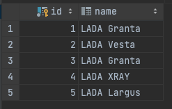

ToMany
Задание.

1. Добавьте репозиторий job4j_hibernate. Добавьте в него checktyle, .gitignore, обязательно заполните файл README.md. В каждом последующем задании будет дополнительно первым пунктом указано в каком репозитории выполнять задание.

2. Создайте модели данных Модель автомобиля и Марка автомобиля. Каждая из моделей имеет 2 поля: id и name.

3. По аналогии с описанием организуйте связь OneToMany: одна марка - много моделей. Важно - мы рассматриваем Unidirectional связь, поэтому аннотация, которая определяет связь между сущностями будет только в одном классе.

4. Напишите код сохранения сущностей в БД. Добавьте 1 марку и связанные с ней 5 моделей.

